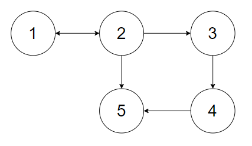

```{r setup, include=FALSE}
knitr::opts_chunk$set(echo = TRUE, eval = FALSE)
```


## Outline

### 1. Motivation

### 2. Working with web mapping data in R
.medium[
- The data
- Basic queries and visualisation
- Converting map data into a graph
]

### 3. Markov Chain on graph
.medium[
- The model  
- Enhancement with web mapping
]

_(Slides are available at `https://github.com/kcf-jackson/ecssc-2021-talk/`.)_


---

## Motivation

### A few simple questions...

.medium[
_"How many cafes / restaurants are there in Melbourne CBD?"_

_"What does the flow between suburbs look like over a typical day?"_

_"If a road is blocked, how much extra time does it cost?"_

_"Given a residential address, how good is its access to shops, supermarkets, restaurants, hospitals, etc.?"_
]

--

.medium[
#### To answer this type of questions, we need:
1. __web mapping data__ ([OpenStreetMap data](https://download.geofabrik.de/index.html), loaded into R with `osmextract`)
2. the capacity to perform __spatial simulation__ and
3. manipulate the __map interactively__ to display information (`sketch` and `leaflet.js`)
]


---

## Working with web mapping data in R

### The data

```{r, echo = T, eval = F}
library(osmextract)
library(sf)
library(dplyr)

file <- "./data/melbourne.osm.pbf"      # Load data
feature_counts <- st_layers(file)       # Get a summary of what's available
```

--

```{r, echo = T, eval = F}
> feature_counts
Driver: OSM 
Available layers:
        layer_name       geometry_type features fields
1           points               Point       NA     10
2            lines         Line String       NA      9
3 multilinestrings   Multi Line String       NA      4
4    multipolygons       Multi Polygon       NA     25
5  other_relations Geometry Collection       NA      4
```


---

## Working with web mapping data in R

### The data

```{r, echo = T, eval = F}
> melb_points <- oe_read(file, "points")  # Import the features
> names(melb_points)
 [1] "osm_id"     "name"       "barrier"    "highway"   
 [5] "ref"        "address"    "is_in"      "place"     
 [9] "man_made"   "other_tags" "geometry"  
```

--

```{r, echo = T, eval = F}
> head(melb_points[, c("osm_id", "other_tags", "geometry")])
Simple feature collection with 6 features and 2 fields
Geometry type: POINT
Dimension:     XY
Bounding box:  xmin: 145.1294 ymin: -37.91224 xmax: 145.1368 ymax: -37.90771
Geodetic CRS:  WGS 84
  osm_id                                         other_tags                   geometry
1 579287                          "traffic_calming"=>"hump" POINT (145.1352 -37.90783)
2 579296                          "traffic_calming"=>"hump" POINT (145.1294 -37.90771)
3 579301                          "traffic_calming"=>"hump"   POINT (145.13 -37.90845)
4 579306                          "traffic_calming"=>"hump" POINT (145.1368 -37.90978)
5 579314                                               <NA> POINT (145.1362 -37.91224)
6 579338 "crossing"=>"uncontrolled","crossing_ref"=>"zebra" POINT (145.1365 -37.91158)
```


---

## Working with web mapping data in R

### Basic queries

```{r, echo = T, eval = F}
# Number of cafes
> sum(grepl("cafe", melb_points$other_tags))
[1] 1918
```

--

```{r, echo = T, eval = F}
# Number of restaurants in Melbourne
> is_restaurant <- grepl("restaurant", melb_points$other_tags)
> sum(is_restaurant)
[1] 2360
```

--

```{r, echo = T, eval = F}
# Number of restaurants in Melbourne CBD
> melb_mpolygons <- oe_read(file, "multipolygons")
> melb_CBD_boundary <- melb_mpolygons |> 
+   filter(name == "City of Melbourne") |>
+   get_points_matrix()
>
> CBD_restaurants <- melb_points[is_restaurant, ] |>
+   filter(in_bound(geometry, melb_CBD_boundary))
> nrow(CBD_restaurants)
[1] 605
```


---


## Working with web mapping data in R

### Basic visualisation (with `sketch` and `leaflet.js`)

<video controls src="./Demo-1.mp4" type="video/mp4" style="height:50vh;"></video>


---

## Working with web mapping data in R

### Converting map data into a graph

.medium[
To simulate movement on a map or compute geodesic distance between two points, a graph is needed.
]

.pull-left[
.medium[
A __graph__ encodes

- a __node-list__: a list of "meaningful" points on the map  
  _RHS: {1,2,3,4,5}_
  
- a __edge-list__: a list of pairs of nodes, indicating the link between the two nodes.  
  _RHS: {(1,2), (2,1), (2,3), (2,5), (3,4), (4,5)}_
]
]

.pull-right[
#### An example of a graph

]

---

## Working with web mapping data in R

### Converting map data into a graph

.medium[

__Suburb graph__

A suburb is represented by its boundary (i.e. a set of coordinates). To construct a suburb graph, 

1. __give each suburb an unique node ID and add to the node-list;__

2. __for any two suburbs that share some boundary points, add an edge between them to the edge-list.__
]

---

## Working with web mapping data in R

### Converting map data into a graph

.medium[
__Street graph__

A street is represented by a sequence of coordinates. To construct a street graph, for each street, 

1. __give each coordinate an unique node ID and add to the node-list__
  - points with the same coordinate should have the same ID
  - the node-list should have contain duplicate entries
2. __add an edge for every two consecutive nodes__
  - if the street is two-way, then also add the edge for the reverse direction
]

--

.medium[
Once the graph is created, one can __use existing algorithms to find the route between any two nodes__, e.g. the A* path-finding algorithm and the multi-level Dijkstra (MLD) algorithm. 

(Alternatively, the `osrm` package handles both the graph building and path-finding for you.)
]


---

## The model: Markov chain on graphs

.medium[
Let $S = \{1,2,,..., n\}$ be the index set of the $n$ nodes ("suburbs") on a graph.
]

--

.medium[
Suppose there are $m$ IID agents travelling on the graph, and 
  - let $A_k(t)$ represent the $k$-th agent and record where the agent is located at discrete time $t\in\mathbb{N}$. 
  - The transition is modelled using a Markov chain with transition probability $P\left(A_k(t+1) = s | A_k(t) = s'\right)$.
]

--

.medium[
For any node / location $s \in S$, 
- count the number of agents present at time $t$, $\displaystyle X_s(t) = \sum_{k = 1}^m 1_{A_k(t) = s}$.

__We are interested in the dynamics of $X_s(t)$ for $s\in S, t \in \mathbb{N}$ __
]


---

## Demo

<video controls src="./Demo-2.mp4" type="video/mp4" style="height:60vh;"></video>


---

## Enhancing the model with web mapping

.medium[
Suppose an agent decides to move from suburb $s$ to suburb $s'$,
]

--

.medium[
We can sample one street node from each of $s$ and $s'$, and make the agent travel the path connecting the two nodes. 

- Macro-level numbers remain exactly the same.

- Extra freedom to model the micro-level movement using another model (statistical or mechanistic).
]


---

## Demo

<video controls src="./Demo-3.mp4" type="video/mp4" style="height:60vh;"></video>


---

## Summary

.medium[
### Key idea

Combine __web map data__, __data analysis / simulation in R__ and __interactive web map display__ to answer spatial and map queries.

### Use cases

`r emo::ji("heavy_check_mark")` Make basic queries and interactively manipulate the map  
`r emo::ji("heavy_check_mark")` Improve the spatial resolution of a Markov chain on graphs  
`r emo::ji("light_bulb")` Planning / evaluating road block disrruption  
`r emo::ji("light_bulb")` Optimal placement of pedestrian counters  
`r emo::ji("light_bulb")` Creating location profiles

]

---


## References

1. OSM data available at Geofabrik https://download.geofabrik.de/ or BBBike: https://download.bbbike.org/osm/bbbike/Melbourne/

2. Australian map tagging guidelines: https://wiki.openstreetmap.org/wiki/Australian_Tagging_Guidelines

3. The `sketch` R package [https://github.com/kcf-jackson/ecssc-2021-talk/](https://github.com/kcf-jackson/ecssc-2021-talk/) and the `leaflet` JavaScript library [https://leafletjs.com/](https://leafletjs.com/).

.pull-left[
I work at the __Bioinformatics and Cellular Genomics lab (BioCellGen)__ @ St. Vincent's Institute of Medical Research (SVI) with __interest in statistical computing and visualisation__.

Talk repo at: [https://github.com/kcf-jackson/ecssc-2021-talk/](https://github.com/kcf-jackson/ecssc-2021-talk/)

Feel free to reach me at [jkwok@svi.edu.au](jkwok@svi.edu.au) or via Slack on __ROpenSci__.
]

.pull-right[
</img>
]

